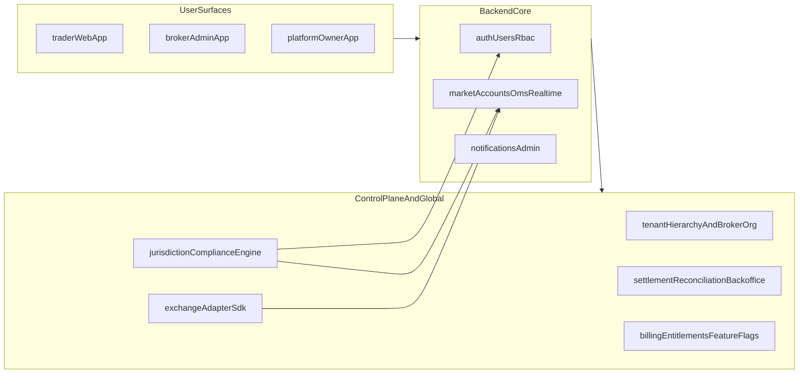

# Global Broker SaaS Scaffold Plan

## Confirmed Scope

- Wave-1 apps: **Trader Web + Broker Admin + Platform Owner (Super Admin)**.
- Exchange/asset adapter packs to scaffold first: **FX/CFD, Equities/F&O, US Equities/Options, Crypto CEX, Commodities**.
- Keep existing `apps/web` as the Trader Web foundation, and add dedicated admin surfaces.

## Current Foundation to Extend

- Nx workspace, cache defaults, and app/lib layout are already in place: [nx.json](nx.json), [tsconfig.base.json](tsconfig.base.json), [package.json](package.json).
- Backend already has strong core domains (auth, users, rbac, market, accounts, oms, realtime, notifications, admin) wired in [apps/backend/src/app.module.ts](apps/backend/src/app.module.ts).
- Web currently has minimal trader flows in [apps/web/src](apps/web/src).

## Target Architecture (Scaffold)

## Phase 1: Scaffold Product Surfaces (3 Apps)

- Keep `apps/web` as **Trader Web** and scaffold route groups for onboarding, portfolio, orders, funds, settings.
- Create `apps/broker-admin` (tenant broker operations) and `apps/platform-owner` (global super-admin control plane).
- Add shared frontend libs for reuse and governance:
  - `libs/ui-kit`
  - `libs/web-auth`
  - `libs/web-api-client`
  - `libs/web-feature-flags`
- Wire project targets and tags in Nx boundaries via [nx.json](nx.json), [apps/web/project.json](apps/web/project.json), and new app `project.json` files.

## Phase 2: Scaffold Multi-Level Broker Hierarchy + Tenancy Control Plane

- Add backend module scaffold for broker hierarchy and tenant governance under:
  - `apps/backend/src/modules/tenancy/`
  - `apps/backend/src/modules/broker-hierarchy/`
- Scaffold entities/services/controllers for:
  - tenant, legal-entity, broker, branch, desk, dealer, hierarchy-role-mapping
  - ownership and delegation model (platform-owner -> broker-admin -> dealer)
- Plug modules into [apps/backend/src/app.module.ts](apps/backend/src/app.module.ts).
- Add `MODULE_DOC.md`, `index.ts`, DTO validation, and tests per module conventions.

## Phase 3: Scaffold Global Exchange Adapter SDK + Connector Packs

- Create a normalized execution connector layer:
  - `apps/backend/src/modules/execution-gateway/`
  - canonical interfaces for order lifecycle, positions, balances, symbols, sessions, webhooks
- Scaffold connector submodules (interface + mock + contract-test harness) for:
  - FX/CFD
  - Equities/F&O
  - US Equities/Options
  - Crypto CEX
  - Commodities
- Integrate adapter selection/routing hooks with OMS flows in `apps/backend/src/modules/oms/`.

## Phase 4: Scaffold Jurisdiction/Compliance Framework (Global Broker Style)

- Add compliance foundation modules:
  - `apps/backend/src/modules/compliance/`
  - `apps/backend/src/modules/onboarding/`
  - `apps/backend/src/modules/risk-policy/`
- Scaffold policy abstractions for:
  - KYC tiers, AML risk flags, sanctions hooks, suitability/product restrictions, audit retention
  - country/jurisdiction profile packs (baseline global + country overrides)
- Add tenant-level compliance policy assignment APIs for broker admins and platform owner.

## Phase 5: Scaffold Backoffice/Ops Domains Needed for MT5-Class Competition

- Add modules for operational completeness:
  - `apps/backend/src/modules/settlement/`
  - `apps/backend/src/modules/reconciliation/`
  - `apps/backend/src/modules/corporate-actions/`
  - `apps/backend/src/modules/limits-and-controls/`
- Expose broker-admin workflows for approvals, breaks, and exception queues.

## Phase 6: Scaffold SaaS Monetization + Platform Governance

- Add platform-owner modules:
  - tenant provisioning lifecycle
  - plan/entitlement/feature-flag management
  - billing/invoicing placeholders
  - platform audit and support impersonation controls
- Frontend scaffold routes in `apps/platform-owner` for tenant management and feature controls.

## Phase 7: Quality Gates, Contracts, and Documentation Scaffolding

- Extend quality checks and architecture constraints in [nx.json](nx.json), [eslint.config.mjs](eslint.config.mjs), and CI workflow [github/workflows/ci.yml](.github/workflows/ci.yml).
- Add contract-test scaffolds per connector pack and per critical API.
- Update module docs and add cross-module architecture docs under `apps/backend/docs/`.

## Deliverables from This Scaffold Wave

- Three app shells ready for iterative UI/UX implementation.
- Backend scaffolds for tenancy hierarchy, global compliance, exchange adapters, operations, and SaaS control plane.
- Clear extension points so any new exchange/country can be added as a module/pack instead of core rewrites.
- Test/documentation skeletons enabling staged hardening in subsequent waves.

