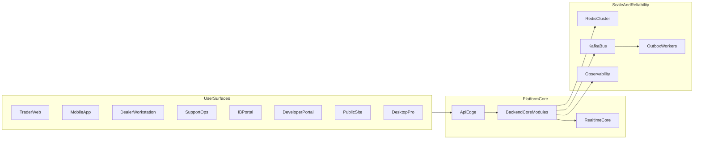

# Wave-2 AWS Enterprise Parallel Blueprint

## Outcome

Create a **day-1 complete baseline** where every required global-broker surface and core architecture foundation exists as scaffolded, wired, and testable components, then harden layer-by-layer.

## Confirmed Strategy

- **Cloud baseline**: AWS-first.
- **Delivery mode**: Balanced enterprise (scaffold breadth + core platform foundations together).
- **Execution speed**: Parallel implementation using focused subagent lanes.

## Target Architecture (Day-1 Baseline)

## Parallel Subagent Workstreams

- **Lane A (Surfaces)**: scaffold all remaining apps and shared UI/client libs.
- **Lane B (Backend Domains)**: scaffold operational/business modules and wire into backend root.
- **Lane C (Connectivity/Scalability)**: scaffold messaging, outbox, resilience, cache, and API-edge integration contracts.
- **Lane D (Quality/Docs/CI)**: enforce Nx boundaries, contract tests, CI quality gates, architecture docs and runbooks.

## Implementation Plan

### 1) Surface Completion (all client entrypoints)

- Add apps:
  - `[apps/mobile](apps/mobile)` (Expo)
  - `[apps/dealer-workstation](apps/dealer-workstation)`
  - `[apps/support-ops](apps/support-ops)`
  - `[apps/ib-portal](apps/ib-portal)`
  - `[apps/developer-portal](apps/developer-portal)`
  - `[apps/public-site](apps/public-site)`
  - `[apps/desktop-pro](apps/desktop-pro)`
- Add shared libs:
  - `[libs/mobile-ui-kit](libs/mobile-ui-kit)`, `[libs/mobile-auth](libs/mobile-auth)`, `[libs/mobile-api-client](libs/mobile-api-client)`
  - `[libs/web-shell](libs/web-shell)`, `[libs/desktop-shell](libs/desktop-shell)`
- Update aliases and project wiring in `[tsconfig.base.json](tsconfig.base.json)` and `[nx.json](nx.json)`.

### 2) Backend Domain Completion (global broker ops)

- Add scaffold modules under `[apps/backend/src/modules](apps/backend/src/modules)`:
  - `dealing`, `support`, `partners`, `developer-platform`
- Each module includes:
  - `controllers/`, `services/`, `entities/`, `dtos/`, `tests/`, `index.ts`, `MODULE_DOC.md`, `project.json`
- Wire all in `[apps/backend/src/app.module.ts](apps/backend/src/app.module.ts)`.

### 3) Connectivity + Scalability Foundations (must-have)

- Add shared architecture scaffolds:
  - `[apps/backend/src/shared/messaging](apps/backend/src/shared/messaging)` (Kafka contracts, publisher/consumer interfaces)
  - `[apps/backend/src/shared/outbox](apps/backend/src/shared/outbox)` (outbox entity + dispatcher worker skeleton)
  - `[apps/backend/src/shared/resilience](apps/backend/src/shared/resilience)` (retry/circuit-breaker wrappers)
  - `[apps/backend/src/shared/cache](apps/backend/src/shared/cache)` (tenant-aware cache keying wrappers)
- Add API-edge contract docs and integration stubs:
  - `[apps/backend/docs/API_EDGE_CONTRACTS.md](apps/backend/docs/API_EDGE_CONTRACTS.md)`
- Extend realtime scale stubs in `[apps/backend/src/modules/realtime](apps/backend/src/modules/realtime)` for node-handoff/session coordination.

### 4) Security + Governance Baseline

- Apply baseline guarding on new module controllers (JWT/Tenant/RBAC pattern alignment).
- Add strict audit envelope stubs for sensitive actions (support impersonation, dealing overrides, partner payouts).
- Add policy placeholders for key areas:
  - API keys/webhooks (developer platform)
  - maker-checker flows (dealing/support)
  - partner entitlement/rebate access controls.

### 5) AWS-first Deployability Scaffolds

- Add infra skeletons:
  - `[infra/aws/terraform](infra/aws/terraform)` for VPC, EKS, RDS, Redis, Kafka placeholders
  - `[deploy/helm](deploy/helm)` for backend and major app charts
- Add environment blueprint docs:
  - `[apps/backend/docs/AWS_DEPLOYMENT_BASELINE.md](apps/backend/docs/AWS_DEPLOYMENT_BASELINE.md)`

### 6) Quality Gates + Contracts + CI

- Extend `[eslint.config.mjs](eslint.config.mjs)` dep constraints for new scopes (`mobile`, `desktop`, new domain tags).
- Extend `[package.json](package.json)` scripts for smoke checks across new apps/modules.
- Extend `[.github/workflows/ci.yml](.github/workflows/ci.yml)` with:
  - mobile lint/test
  - desktop smoke
  - connector/developer-platform contract tests
  - architecture checks (cycles/duplicates already present, keep enforced).

### 7) Documentation and Day-1 Readiness Ledger

- Update architecture and readiness docs:
  - `[apps/backend/docs/GLOBAL_BROKER_SAAS_ARCHITECTURE.md](apps/backend/docs/GLOBAL_BROKER_SAAS_ARCHITECTURE.md)`
  - `[apps/backend/docs/ENTERPRISE_CHECKLIST.md](apps/backend/docs/ENTERPRISE_CHECKLIST.md)`
- Add Wave-2 runbook and phase ledger:
  - `[apps/backend/docs/WAVE2_DAY1_BASELINE.md](apps/backend/docs/WAVE2_DAY1_BASELINE.md)`
  - include status for each app/module (scaffolded, wired, tested, hardening-pending).

## Done Criteria

- All listed apps/modules/libraries exist with compile-safe skeletons.
- New backend modules wired in root module and pass build.
- Connectivity/scalability shared scaffolds exist with test stubs.
- CI includes checks for new projects.
- Architecture/readiness docs updated with explicit hardening backlog.

