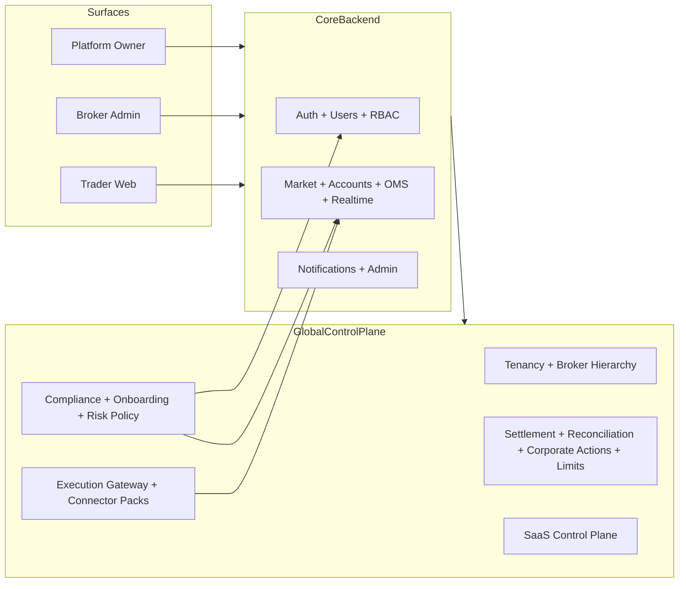

# Global Broker SaaS Architecture Scaffold

## Objective
Provide a modular Nx backend and multi-surface frontend foundation for a global broker SaaS
platform that can extend to new countries and exchange families without core rewrites.

## Wave-1 Surfaces
- `apps/web` (Trader Web)
- `apps/broker-admin` (Broker operations and hierarchy controls)
- `apps/platform-owner` (Global SaaS governance)

## Wave-1 Backend Domains
- Existing core: `auth`, `users`, `rbac`, `market`, `accounts`, `oms`, `realtime`, `notifications`, `admin`
- Added control plane and global scaffold modules:
  - `tenancy`
  - `broker-hierarchy`
  - `execution-gateway`
  - `compliance`
  - `onboarding`
  - `risk-policy`
  - `settlement`
  - `reconciliation`
  - `corporate-actions`
  - `limits-and-controls`
  - `saas-control-plane`

## Architecture Flow

## Extension Rules
1. New exchange families should be added as connector packs under `execution-gateway/connectors/`.
2. New jurisdiction policies should be added via `compliance` and `risk-policy` records rather than hardcoding logic.
3. New broker structures should extend `broker-hierarchy` entities and role maps.
4. New SaaS plans/features should be represented in `saas-control-plane` entitlements and feature flags.

## Next Hardening Waves
- Real exchange connectivity and order-state reconciliation.
- Real KYC/AML/sanctions provider integrations.
- Billing provider integration and invoice lifecycle automation.
- Queue/event-bus fanout and multi-region deployment strategy.
