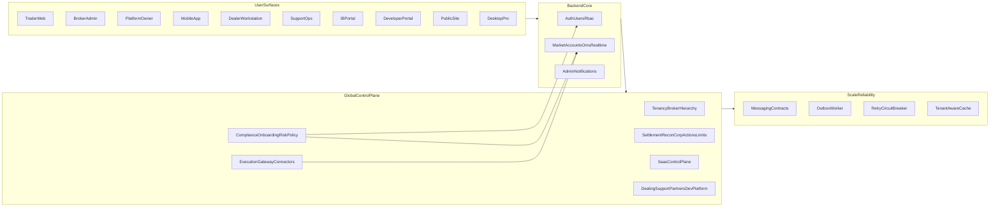

# Global Broker SaaS Architecture Scaffold

## Objective
Provide a modular Nx backend and multi-surface frontend foundation for a global broker SaaS platform
that can extend to new countries and exchange families without core rewrites.

## Wave-1 Surfaces
- `apps/web` (Trader Web)
- `apps/broker-admin` (Broker operations and hierarchy controls)
- `apps/platform-owner` (Global SaaS governance)

## Wave-2 Surfaces
- `apps/mobile`
- `apps/dealer-workstation`
- `apps/support-ops`
- `apps/ib-portal`
- `apps/developer-portal`
- `apps/public-site`
- `apps/desktop-pro`

## Backend Domains
- Existing core: `auth`, `users`, `rbac`, `market`, `accounts`, `oms`, `realtime`, `notifications`, `admin`
- Control-plane/global domains:
  - `tenancy`, `broker-hierarchy`, `execution-gateway`, `compliance`, `onboarding`
  - `risk-policy`, `settlement`, `reconciliation`, `corporate-actions`, `limits-and-controls`, `saas-control-plane`
- Wave-2 operational domains:
  - `dealing`, `support`, `partners`, `developer-platform`

## Platform Infrastructure Scaffolds
- Shared connectivity/scaling: `shared/messaging`, `shared/outbox`, `shared/resilience`, `shared/cache`
- Realtime scale coordination: `realtime-scale-coordinator.service.ts` (stub)
- AWS deployability baseline:
  - Terraform skeleton: `infra/aws/terraform`
  - Helm skeleton: `deploy/helm`

## Architecture Flow

## Extension Rules
1. Add new exchange families only under `execution-gateway/connectors`.
2. Add new jurisdiction requirements via `compliance`/`risk-policy` data and pack modules.
3. Extend broker structure using `broker-hierarchy` entities and delegated role mappings.
4. Extend monetization/governance through `saas-control-plane` plans, entitlements, and flags.
5. Route asynchronous cross-domain work through outbox + messaging rather than direct coupling.

## Hardening Backlog
- Real exchange connectivity and reconciliation loops.
- Real KYC/AML/sanctions provider integrations.
- Billing provider integration and invoice lifecycle automation.
- Real API-edge gateway + WAF + rate-limit policy enforcement.
- Multi-region HA/DR and queue-backed fanout hardening.
