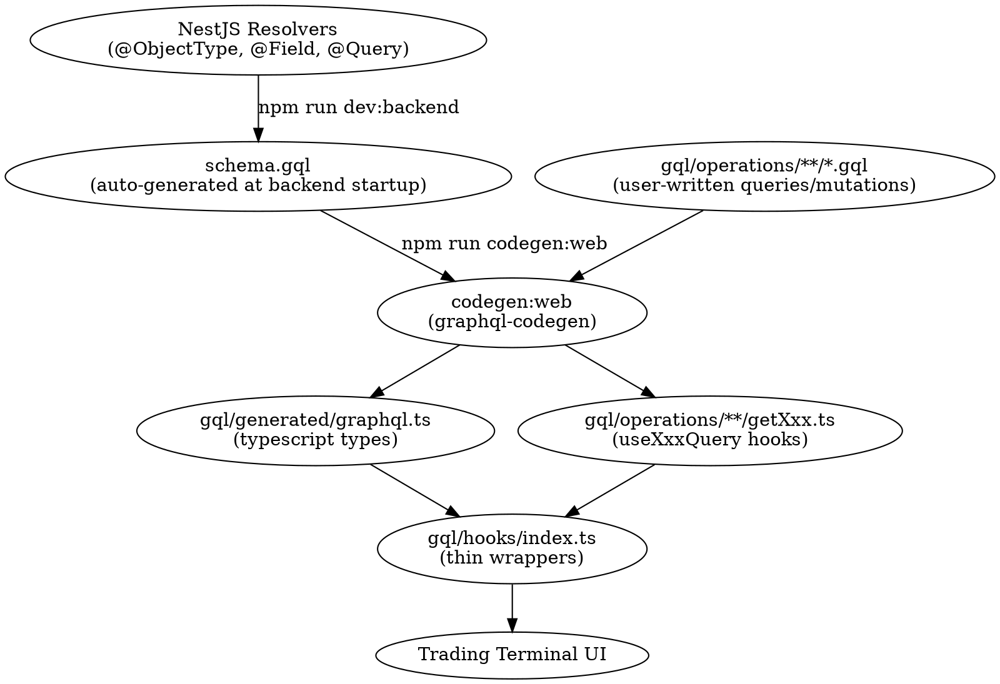

# GraphQL Integration Guide — Obsidian Platform

## Current State (2026-05-30)

The GraphQL integration is now working end-to-end via codegen. Here's how it works:

### The Pipeline (Enterprise Standard)



### File Structure

```
apps/web/gql/
├── client/              # Apollo client config (already working)
│   ├── apollo-client.ts
│   ├── auth-link.ts
│   └── error-link.ts
├── operations/          # GraphQL operations (WRITTEN BY DEVELOPER)
│   ├── oms/
│   │   ├── getOrders.gql
│   │   ├── placeOrder.gql
│   │   ├── cancelOrder.gql
│   │   └── modifyOrder.gql
│   ├── market/
│   │   ├── getInstruments.gql
│   │   ├── getWatchlists.gql
│   │   └── getQuote.gql
│   ├── accounts/
│   │   └── getAccountBalance.gql
│   └── auth/
│       └── getMe.gql
├── generated/          # AUTO-GENERATED by codegen (DO NOT EDIT)
│   └── graphql.ts      # All TypeScript types from schema
├── hooks/              # Thin wrappers around generated hooks
│   ├── index.ts        # Barrel export
│   ├── useOrders.ts    # useOrders() → useGetOrdersQuery()
│   ├── usePlaceOrder.ts
│   └── usePositions.ts
└── codegen.ts          # Codegen configuration
```

### Development Workflow

**Step 1: Write the GQL operation**
```graphql
# apps/web/gql/operations/oms/getOrders.gql
query GetOrders($accountId: ID, $status: String, $limit: Int, $offset: Int) {
  orders(accountId: $accountId, status: $status, limit: $limit, offset: $offset) {
    data { id clientOrderId status }
    total limit offset
  }
}
```

**Step 2: Run codegen**
```bash
npm run codegen:web
```

**Step 3: Codegen generates**
```typescript
// apps/web/gql/operations/oms/getOrders.ts
export function useGetOrdersQuery(baseOptions) { ... }
export type GetOrdersQuery = { orders: { data: Order[], total: number } }
```

**Step 4: Wrap in thin custom hook (optional but recommended)**
```typescript
// apps/web/gql/hooks/useOrders.ts
import { useGetOrdersQuery } from '../operations/oms/getOrders';

export function useOrders(filters?: OrderFilters) {
  return useGetOrdersQuery({ variables: filters });
}
```

### Commands

```bash
npm run codegen:web      # Generate types + hooks from schema + operations
npm run graphql:schema   # (Broken) Generate schema from resolvers
npm run dev:backend      # Start backend (generates schema.gql)
npm run dev:web          # Start trader terminal
```

### What's Working Now

- ✅ Schema generation (fixed — all missing types added)
- ✅ Codegen runs successfully
- ✅ Types generated in `gql/generated/graphql.ts`
- ✅ Hooks generated in `gql/operations/**/*.ts`
- ✅ Custom wrapper hooks in `gql/hooks/`
- ✅ All hooks type-check without errors

### What Still Needs Work

- [ ] P4: Wire hooks to trading terminal components
- [ ] P5: Real-time WebSocket (PranaStream)
- [ ] Fix remaining 23 type errors in `mock-data.ts` and `bottom-tabs-panel.tsx` (pre-existing)

### Key Files

| File | Purpose |
|------|---------|
| `apps/backend/src/generated/schema.gql` | Source of truth for GraphQL schema |
| `apps/web/codegen.ts` | Codegen configuration |
| `apps/web/gql/operations/**/*.gql` | Developer-written GraphQL queries/mutations |
| `apps/web/gql/generated/graphql.ts` | Generated TypeScript types |
| `apps/web/gql/hooks/index.ts` | Exported hooks for UI consumption |

### Rules

1. **Write GQL operations** in `gql/operations/**/*.gql` (not .ts)
2. **Run `npm run codegen:web`** after writing/changing operations
3. **Don't edit** `gql/generated/*` files (they're overwritten on codegen)
4. **Wrap generated hooks** in `gql/hooks/` for better DX (optional but recommended)
5. **If schema is missing types**, fix `apps/backend/src/generated/schema.gql` (add the missing type definitions)